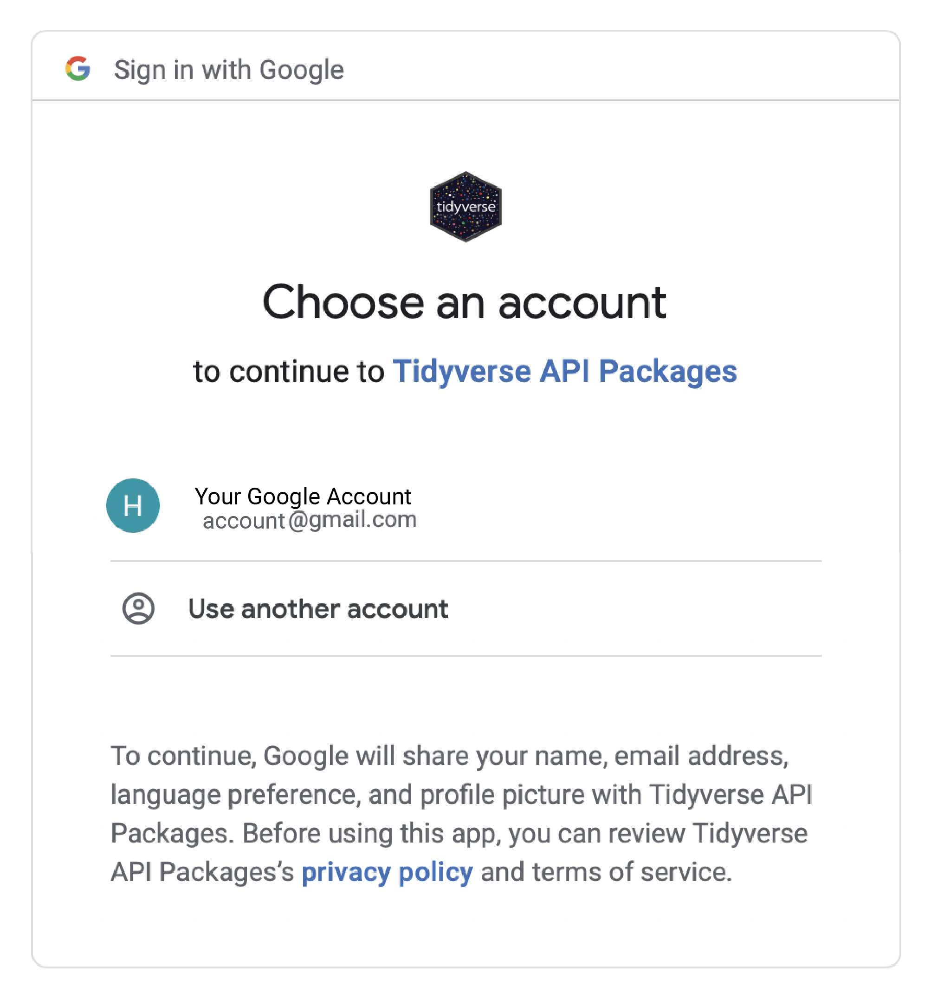
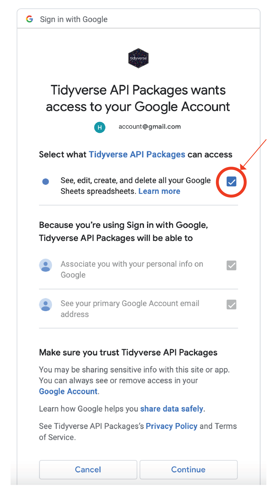
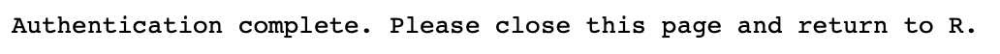

# Using Google Sheets in R

## Learning Objectives

This KB entry will discuss the usage of the R package `googlesheets4` for handling information in Google Sheets in R. In this KB entry, we will:
- Connect a Google account to R
- Write a data frame to a Google Sheet
- Read in a Google Spreadsheet into a data frame

## Connecting a Google Account to R

The first step to connecting a Google Account to R is to load the `googlesheets4` package:

```
install.packages("googlesheets4")
library(googlesheets4)
```

Next, we will need to connect R to our Google account with the following command:

```
gs4_auth()
```

This should open up a default browser window that should look similar to this:

<p align="center">

</p>

Select the account you would like to authenticate.

> Note: If you want to see all of the authenticated Google Accounts, you can also use the aforementioned command.

The next window in your browser should like look this:

<p align="center">

</p>

Be sure to click the box next to "See, edit, create and delete all your Google Sheets spreadsheets" and click "Continue".

If successful, the next page in your browser should look:

<p align="center">

</p>

If you want to authenticate more accounts or see which account are authenticated, then you can just use:

```
gs4_auth()
```

Now your R is connected to your Google Account!

## Write a data frame to a Google Sheet

### Creating a Google Sheet

Now that our Google account is connected to R, we can export data frames directly to a Google Sheet. However, first we need to create the spreadsheet that we are going to export to. This is done with the `gs4_create()` command. We will create a spreadsheet called "mtcars" using this.

```
gs4_create("mtcars")
```

The command prompt should return:

```
✔ Creating new Sheet: mtcars.
```

It is also possible to build multiple tabs in your spreadsheet using the `gs4_create()` function. If we wanted one tab to be called "mtcars" and the other tab to be called "iris", it would look like:

```
gs4_create("sample_data", sheets = c("mtcars", "iris"))
```

If you already had a dataframe that you directly wanted to export to Google Sheets you can do that as well:

```
gs4_create("mtcars_2", sheets = mtcars)
```

This will create a spreadsheet called "mtcars_2" and and will use the data in mtcars to populate it.

If you have multiple tabs you want in a export to a Google Sheet then that would look like:

```
gs4_create("sample_data_2", sheets = list(mtcars_tab = mtcars, iris_tab = iris))
```

This will create a Sheet named "sample_data_2", where the first tab will be called "mtcars_tab" and contain the data in `mtcars` and the second tab will be called "iris_tab" and contain the data in `iris`.

## Finding a Google Sheet

You can also search your Google Drive for Sheets that you are looking for using the `gs4_find()` function. If no arguments are provided then it will return all of the Google Sheets that have been shared with you or created by you.

```
# Returns all Sheets
gs4find()
```

> Note: The first time you use `gs4find()`, you ight be asked to authenticate again. You can follow similar directions to the one above for authenticating.

If you know the name of the Sheet you are looking for, then you can provide that:

```
gs4_find("sample_data_2")
```

It is important to note that if multiple Sheets match the search criteria for the name, then all will be returned. For example:

```
gs4_find("sample_data")
```

This will return "sample_data" and "sample_data_2".

One nice feature of this is that it will provide the Google Drive ID for the file in the `id` column which is a unique identifer for a Google Sheet and can be used when reading in a Sheet. This Google Drive ID (labelled below as "GOOGLE_DRIVE_ID") can also be found in the URL of the Google Sheet:

`https://docs.google.com/spreadsheets/d/GOOGLE_DRIVE_ID`

### Appending a Google Sheet

You can also append a Google Sheet using the `sheet_append()` function. In order to demonstrate this we need to make a new dataframe that we want to add:

```
data_to_add_to_iris <- data.frame(col1= c(5.5, 6.2), col2 = c(3.5, 3.6), col3 = c(1.4, 1.7), col4 = c(0.3,0.4), col5 = c("rose","rose"))
```

Now we can append the sheet:

```
sheet_append(gs4_find("sample_data_2"), data_to_add_to_iris, sheet = "iris_tab")
```

You can replace the `gs4_find("sample_data_2")` with the Google Drive ID or URL, but to make this example more universal, I chose to use this function.

### Overwriting a Google Sheet

You can also overwrite a Google sheet using the `sheet_write()` function. 

```
sheet_write(iris, "https://docs.google.com/spreadsheets/d/1CIvBGKSWoe-h2WNeBr6-eqB40xdhQ9ACZukrNsSgGFA", sheet = "iris_tab")
```

Now we can see that we have overwritten our `iris` tab again. 

## Reading in a Google Sheet

You can also read a Google Sheet using the `read_sheet()` function. To read in a sheets, use:

```
read_sheet("URL_of_sheet")
```

A sample can be found here:

```
mtcars_example <- read_sheet("https://docs.google.com/spreadsheets/d/1CIvBGKSWoe-h2WNeBr6-eqB40xdhQ9ACZukrNsSgGFA")
```

Likewise, you can use the Google Drive ID:

```
mtcars_example_2 <- read_sheet("1CIvBGKSWoe-h2WNeBr6-eqB40xdhQ9ACZukrNsSgGFA")
```

And as long as your Sheet name is unique you can use the `gs4_find()` function in conjunction with your `read_sheet()` function to read in a Sheet:

```
mtcars_example_3 <-  read_sheet(gs4_find("sample_data_2"))
```

One problem with this is that Google Sheets will by default only import the first tab of a Google Sheet. If you want a different tab, you'll need to specify it specifically with the `sheet` argument. In our example, we have mtcars in the first tab but iris in the second tab. If we wanted the second `iris` tab of the spreadsheet, then we would need to do:

```
iris_example <- read_sheet("https://docs.google.com/spreadsheets/d/1CIvBGKSWoe-h2WNeBr6-eqB40xdhQ9ACZukrNsSgGFA", sheet = "iris")
```
