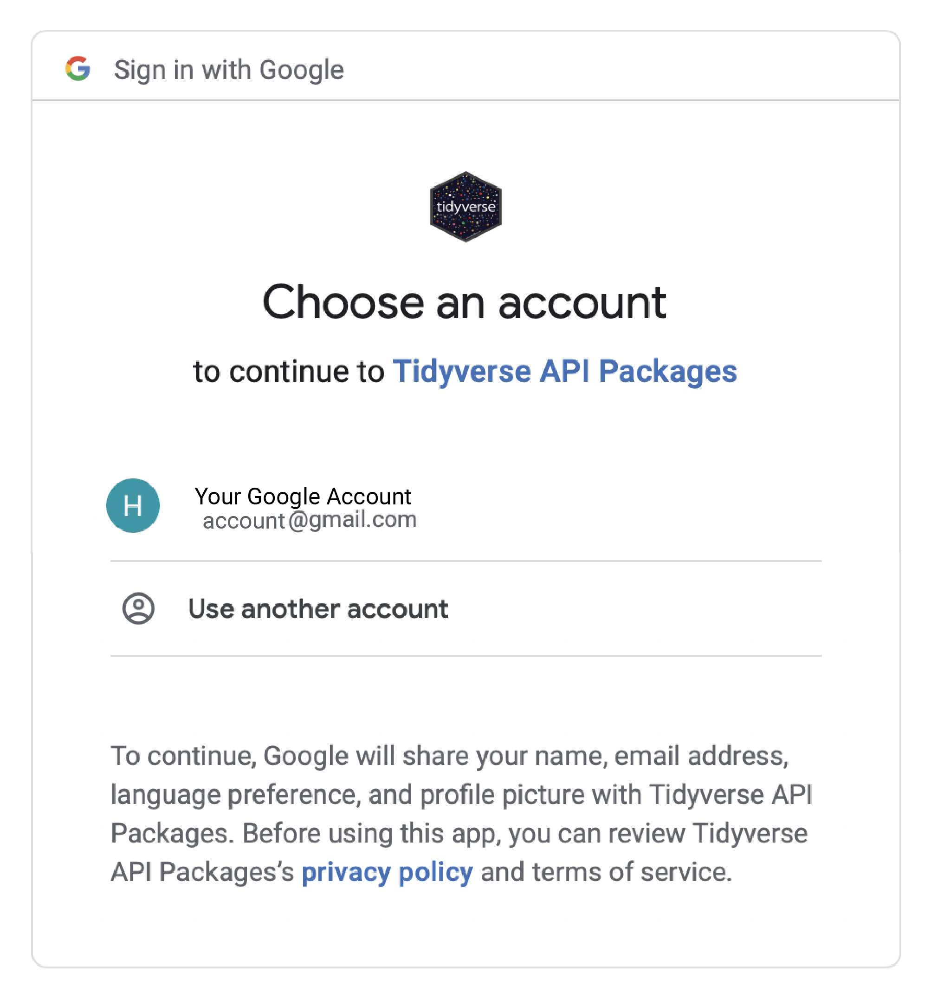

# Using Google Sheets in R

## Learning Objectives

This KB entry will discuss the usage of the R package `googlesheets4` for handling information in Google Sheets in R. In this KB entry, we will:
- Connect a Google account to R
- Read in a Google Spreadsheet into a data frame
- Write a data frame to a Google Spreadsheet

## Connecting a Google Account to R

The first step to connecting a Google Account to R is to load the `googlesheets4` package:

```
install.packages("googlesheets4")
library(googlesheets4)
```

Next, we will need to connect R to our Google account with the following command:

```
gs4_auth()
```

This should open up a default browser window that should look similar to this:

<p align="center">

</p>

> Note: If you want to see all of the authenticated Google Accounts, you can also use the aforementioned command. 
