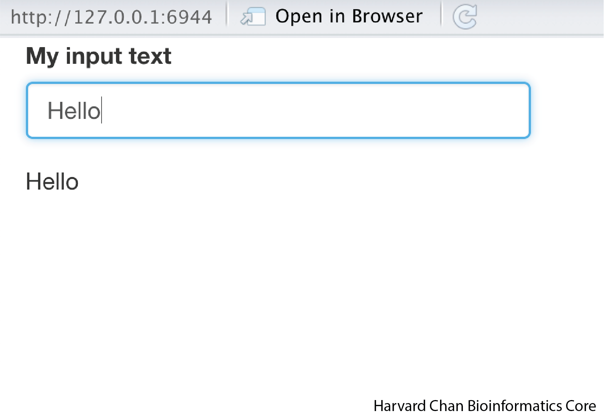

# R Shiny

R Shiny is a package within R that allows the user to create interactive HTML pages that can handle a wide range of applications. Due to the diverse array of applications for R Shiny Apps, there is no way to cover all of these in a single page. However, the goal of this page is to provide a primer on how to start building R Shiny Apps.

## Learning Objectives

- Describe the difference between UI and Server and associated functions within R Shiny
- Create basic R Shiny apps

## Shiny Structure

When creating an app within R Shiny the first place to start is by naming your app. It is a good idea to name your R script `app.R` and place it within a directory that has a meaningful name. For example, your directory might be named `Hello_world` and within this directory you have the R script, `app.R`

Next, we need to understand the difference between the user interface (UI) and server. The UI is the HTML rendering of your Shiny App and is referred to as your front-end since it is what users who interact with your app will see. The server is where the inputs from the UI are processed and output to the UI is returned from. The server is oftentimes referred to as the back-end.  

<p align="center">

</p>

The last component of the a Shiny app is the `shinyApp` function which launches the app. 

## Shiny Syntax

A typical Shiny App will have a structure that looks something like:

```
ui <- fluidPage(
    [function]Input("input_variable"),
    ...
    [function]Output("output_variable")
    )
    
server <- function(input, output){
    output$output_variable <- render[Format]({
        input$input_variable ...
    })
}

shinyApp(ui = ui, server = server)
```

Let's break this down a bit more and talk about each of these components:

First, let's talk about the UI side where everything gets assigned to the `ui` object:

- `fluidPage()` is a function that is going to be used in the rendering of the HTML
- `[function]Input("input_variable")` This is how you will provide your input. The `"input_variable"` is called your inputID and this is how you will be calling this input on the server. When naming these inputIDs stay within R variable naming conventions. There are lots of different types of inputs, including:
  - `textInput()` This is for taking in a single line of text
  - `textAreaInput()` This is for taking in text in a textbox style
  - `sliderInput()` This provides an slider to select values
  - `selectInput()` This provides a list of values to choose from
  - Many more  
- `[function]Output("output_variable")` This is your output that will be visualized. The `"output_variable"` is your outputID and this is what you named your output on the server side. Like inputIDs, outputIDs should follow R variable naming convetions. Some common functions here are:
  - `textOutput()` This returns text output and is usually paired with `renderText({})` on the server side
  - `verbatimTextOutput()` This returns output styled exactly how output looks in R and is usually paired with `renderPrint({})` on the server side
  - `tableOutput()` This returns a table and is usually paired with `renderTable({})` on the server side
  - `plotOutput()` This returns a plot and is usually paired with `renderPlot({})` on the server side


Second, let's talk about the server side where everything is assigned to the `server` object:

- `function(input, output){}` This is always the start to your server and it begins a function to be processed
- `output$output_variable <- render[Format]({})` This is what you are assigning the output to. The `render[Format]({})` function can have several forms:
    - `renderText({})` Prints text and is usually paired with `textOutput()` on the UI side
    - `renderPrint({})` Prints text that way it comes from the R console and is usually paired with `verbatimTextOutput()` on the UI side
    - `renderTable({})` Prints a table and is usually paired with `tableOutput()` on the UI side
    - `renderPlot({})` Prints a plot and is usually paired with `plotOutput()` on the UI side
    - `input$input_variable ...` This is just saying that we are going to do something with the `input_variable`
    
Lastly, the UI and the server side are tied together and launched with:

```
shinyApp(ui = ui, server = server)
```

## Writing your first Shiny App

Let's write a simple app that can help reinforce some of these principles. The goal of this app is simply to return text that you have provided as input. While this is an overly simplistic app, it will demonstrate many of the core idea that are integral to an R Shiny App. Here is the code we will use:

```
library(shiny)

ui <- fluidPage(
    inputText("input_text", "My input text"),
    outputText("output_text")
)

server <- function(input, output){
    output$output_text <- renderText({input$input_text})
}

shinyApp(ui = ui, server = server)
```

Once we have tyoped this, we can hit <kbd>Command</kbd> + <kbd>Shift</kbd> + <kbd>Return</kbd> on a Mac or hit "Run App" in the top of your R Studio window. You app should pop up looking like:

<p align="center">

</p>

And when you type something in like "Hello", "Hello" should appear appear below:

<p align="center">

</p>

Let's discuss what is happening here:

- `ui <- fluidPage()` Using a `fluidPage` function to to render an HTML and assigning it to the `ui` object
- `inputText("input_text", "My input text"),` This is the input text that we are going to give to the server and it is going to be assigned the variable `input$input_text`. The `"My input text"` is what we want to title the text box. **Also, note the use of a comma at the end of this `inputText`** function. Each function inside of the `fluidPage()` function needs to be separated by a comma.
- `outputText("output_text")` This is the output text from the server that we want displayed. 

- `server <- function(input, output){}` We are opening a function on the server side and assigning it to the `server` object
- `output$output_text <- renderText({input$input_text})` Here, we are telling R to render the text output of `input$input_text` and assign that to the variable `output$output_text`

- `shinyApp(ui = ui, server = server)` Run the Shiny App

While, we have written a simplistic app here, it has many of the core features that we might be interested in utilizing. Armed with this basic understanding of some of the R Shiny syntax, let's tackle a slightly more complex R Shiny App.

## Your Second R Shiny App: Using a slider to provide input and then performing a arithmetic function on it

In this app we are going to use a slider to select a value and then have our app return the squared value of it. The code for this app should look like:

```
ui <- fluidPage(
    sliderInput("number", "Select a number to square", min = 1, max = 10, value = 5),
    textOutput("squared_number")
)

server <- function(input, output){
    output$squared_number <- renderText({
        input$number **2
    })
}

shinyApp(ui = ui, server = server)
```

Run the app and it should look like:

<p align="center">

</p>

***

# Old Info

---
title: How to set up new app in hbc rshiny
description: Information on where to connect and where to put apps in hbc rshiny server.
category: admin
subcategory: guides
tags: [visualization, report]
---

To get access to the server, ask to the Director or Associate Director of the core

The server is only reachable from HMS network. The typical way to connect is from the login node in O2. Type this:

```
ssh hbcreports.med.harvard.edu
```

Use the password given to you by HMS RC team.

Once inside, copy the folder that contains the code for you app inside `/srv/shiny-server/`, from that point, the app should be available at http://hbcreports.med.harvard.edu/`app_name`/. For instance, look at this: http://hbcreports.med.harvard.edu/heatmaps/


**installation of new packages affect to all current apps. This need to be coordinated with the responsible person in the core. Raise any need to install or update during group meeting.**
