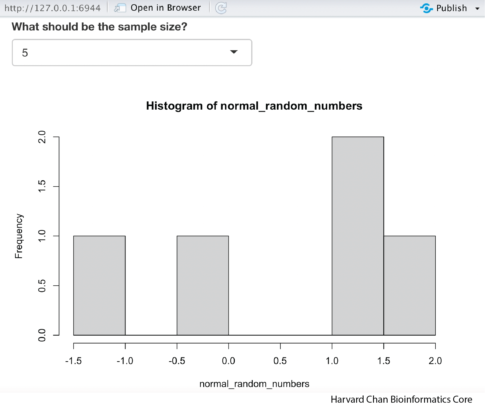
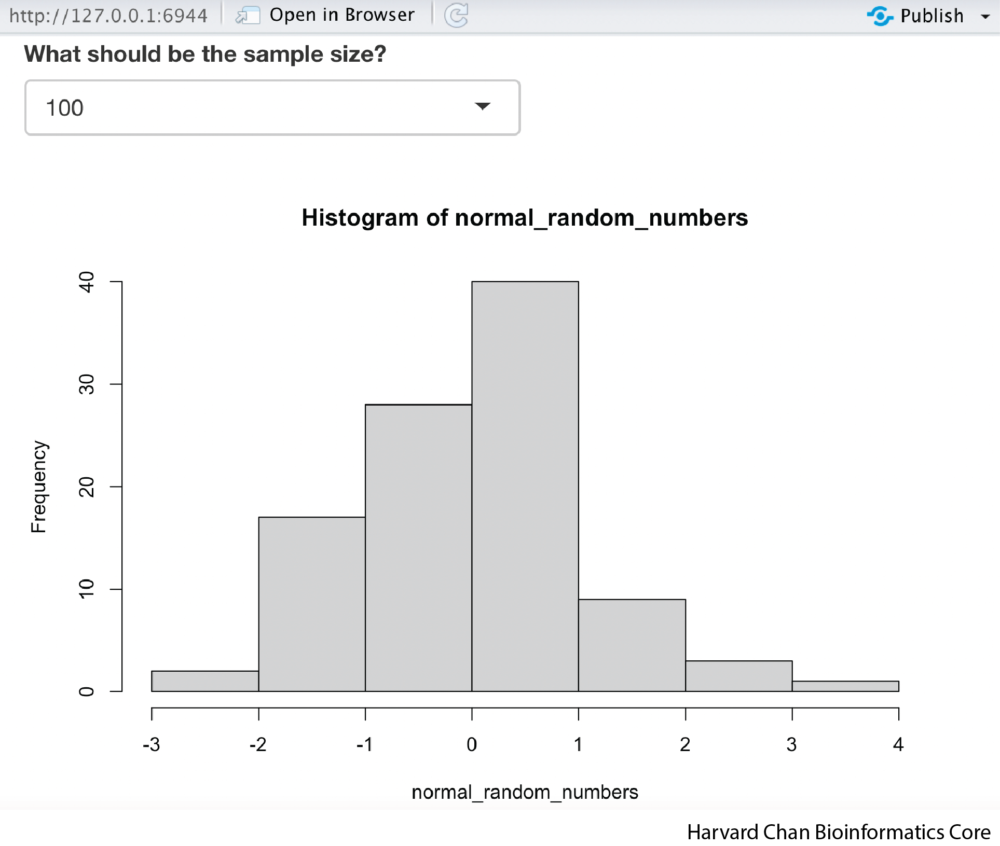

# R Shiny

R Shiny is a package for R that allows users to create interactive HTML pages that can handle a wide range of applications. Due to the diverse array of applications for R Shiny Apps, there is no way to cover all of these in a single page. However, the goal of this page is to provide a primer on how to start building R Shiny Apps.

## Learning Objectives

- Describe the difference between UI and Server and associated functions within R Shiny
- Create basic R Shiny apps

## Shiny Structure

When creating an app within R Shiny the first place to start is by naming your app. It is a good idea to name your R script `app.R` and place it within a directory that has a meaningful name. For example, your directory might be named `Hello_world` and within this directory you have the R script, `app.R`. This convention will be helpful later when you try to host your app online somewhere.

Next, we need to understand the difference between the user interface (UI) and server. The UI is the HTML rendering of your Shiny App and is referred to as your front-end since it is what users who interact with your app will see. The server is where the inputs from the UI are processed and output to the UI is returned from. The server is oftentimes referred to as the back-end.  

<p align="center">

</p>

The last component of the a Shiny app is the `shinyApp` function which launches the app. 

## Shiny Syntax

A typical Shiny App will have a structure that at bare minimum looks something like:

```
ui <- fluidPage(
    [format]Input("input_variable"),
    ...
    [format]Output("output_variable")
    )
    
server <- function(input, output){
    output$output_variable <- render[Format]({
        input$input_variable ...
    })
}

shinyApp(ui = ui, server = server)
```

Let's break this down a bit more and talk about each of these components:

First, let's talk about the UI side where everything gets assigned to the `ui` object:

- `fluidPage()` is a function that is going to be used in the rendering of the HTML
- `[format]Input("input_variable")` This is how you will provide your input. The `"input_variable"` is called your inputID and this is how you will be calling this input on the server. When naming these inputIDs stay within R variable naming conventions. There are lots of different types of inputs, including:
  - `textInput()` This is for taking in a single line of text
  - `textAreaInput()` This is for taking in text in a textbox style
  - `numericInput()` This is similar to `textInput()`, but instead of text, you can provide it a number
  - `sliderInput()` This provides an slider to select values
  - `selectInput()` This provides a list of values to choose from
  - Many more  
- `[format]Output("output_variable")` This is your output that will be visualized. The `"output_variable"` is your outputID and this is what you will name your output on the server side. Like inputIDs, outputIDs should follow R variable naming convetions. Some common functions here are:
  - `textOutput()` This returns text output and is usually paired with `renderText({})` on the server side
  - `verbatimTextOutput()` This returns output styled exactly how output looks in R and is usually paired with `renderPrint({})` on the server side
  - `plotOutput()` This returns a plot and is usually paired with `renderPlot({})` on the server side
  - `dataTableOutput()` This returns a table and is usually paired with `renderDataTable({})` on the server side
> Note: The table functions from the `DT` package, `DTOutput()` and `renderDT()`, respectively, are the standard functions to use for rendering tables now.

Second, let's talk about the server side where everything is assigned to the `server` object:

- `function(input, output){}` This is always the start to your server object and it opens a function to be processed
- `output$output_variable <- render[Format]({})` This is what you are assigning the output to. The `render[Format]({})` function can have several forms:
    - `renderText({})` Prints text and is usually paired with `textOutput()` on the UI side
    - `renderPrint({})` Prints text that way it comes from the R console and is usually paired with `verbatimTextOutput()` on the UI side
    - `renderPlot({})` Prints a plot and is usually paired with `plotOutput()` on the UI side
    - `renderDataTable({})` Prints a table and is usually paired with `dataTableOutput()` on the UI side or when using the `DT` package, `renderDT()` and is usually paired with `DTOutput()` on the UI side
    - The `{}` within the `render` family of functions is only needed when there is more than one command within the `render` function. However, it is fine to include it when there is only a single command as well. As a result, we will use it in every function so that it is consistent between our differerent apps. 
    - `input$input_variable ...` This is just saying that we are going to do something with the `input_variable`
    
Lastly, the UI and the server side are tied together and the app is launched with:

```
shinyApp(ui = ui, server = server)
```

## Your First R Shiny App

Let's write a simple app that can help reinforce some of these principles. The goal of this app is simply to return text that you have provided as input. While this is an overly simplistic app, it will demonstrate many of the core ideas that are integral to an R Shiny App. Here is the code we will use:

```
library(shiny)

ui <- fluidPage(
    textInput("input_text", "My input text"),
    textOutput("output_text")
)

server <- function(input, output){
    output$output_text <- renderText({
        input$input_text
    })
}

shinyApp(ui = ui, server = server)
```

Once we have copied and pasted this, we can hit <kbd>Command</kbd> + <kbd>Shift</kbd> + <kbd>Return</kbd> on a Mac or hit "Run App" in the top of your R Studio window. Your app should pop up looking like:

<p align="center">

</p>

And when you type something in like "Hello World", "Hello World" should appear below:

<p align="center">

</p>

**NOTE: If you look at your console it is currently listening for input and you cannot use your console for other tasks. Before you can do anything else in R, you will need to close the app or hit the stop sign in the console.**

Let's discuss what is happening here:

- `ui <- fluidPage()` Using a `fluidPage` function to to render an HTML and assigning it to the `ui` object
- `inputText("input_text", "My input text"),` This is the input text that we are going to give to the server and it is going to be assigned the variable `input$input_text`. The `"My input text"` is what we want to title the text box to be. **Also, note the use of a comma at the end of this `inputText()`** function. Each function inside of the `fluidPage()` function needs to be separated by a comma.
- `outputText("output_text")` This is the output text from the server that we want displayed.

> **NOTE:** The order of `inputText()` and `outputText()` will determine where they are placed on our HTML page. If we had `outputText()` before `inputText()`, then our returned text would be above our input text on the rendered HTML page.

- `server <- function(input, output){}` We are opening a function on the server side and assigning it to the `server` object
- `output$output_text <- renderText({input$input_text})` Here, we are telling R to render the text output of `input$input_text` and assign that to the variable `output$output_text`

- `shinyApp(ui = ui, server = server)` Run the Shiny App

The process of this app is outlined in the figure below:

<p align="center">

</p>

While, we have written a simplistic app here, it has many of the core features that we are interested in utilizing. Armed with this basic understanding of some of the R Shiny syntax, let's tackle a slightly more complex R Shiny App.

## Your Second R Shiny App: Using a slider to provide input and then performing an arithmetic function on it

In this app we are going to use a slider to select a value and then have our app return the squared value of it. The code for this app should look like:

```
library(shiny)

ui <- fluidPage(
    sliderInput("number", "Select a number to square", min = 1, max = 10, value = 5),
    textOutput("squared_number")
)

server <- function(input, output){
    output$squared_number <- renderText({
        input$number ** 2
    })
}

shinyApp(ui = ui, server = server)
```

Run the app and the pop-up window should look like:

<p align="center">

</p>

Let's take a closer look at the new parts to this code:

- `sliderInput("number", "Select a number to square", min = 1, max = 10, value = 5),` Instead of providing a text input, you are using a slider to gather our input. `"number"` is what we want the inputID to be, `"Select a number to square"` is the title for the slider, `min = 1` is setting the minimum value of the slider, `max = 10` is setting the maximum value of the slider and `value = 5` is setting the default value for the slider.
- `textOutput("squared_number")` This is returning the squared number output
- The code block below is taking `input$number` and squaring it, then assigning the text to be rendered into the`output$squared_number` object
    ```
    output$squared_number <- renderText({
        input$number ** 2
    })
    ```

Hopefully, at this point you are becoming slightly more comfortable with the syntax employed by R Shiny! Let's try another example to further our understanding.

## Exercise

Create an R Shiny App that does the following:

1) Collects a *numeric input*
2) Collects input from a slider ranging from 1 to 20
3) Multiples the numeric input from 1) by the the slider numeric input from 2)
4) Returns the product as text

<details>
    <summary><b>Click here to see the answer</b></summary>
    <pre>
library(shiny)<br>


ui <- fluidPage(
&nbsp; numericInput("a", "First number to multiply", 5),
&nbsp; sliderInput("b", "Second number to multiply", min = 1, max = 20, value = 5),
&nbsp; textOutput("product")
)

server <- function(input, output){
&nbsp; output$product <- renderText({
&nbsp; &nbsp; input$a * input$b
&nbsp; })
}

shinyApp(ui = ui, server = server)</pre>
</details>

## Your Third R Shiny App: Selecting a value from a dropdown menu for sample size and creating a random normal distribution from this sample size

In this app, we are going to select a value to use as our sample size from a dropdown menu and then have the app return a random normal distribution plot using this value as the sample size parameter. Copy and paste the code below:

```
library(shiny)

ui <- fluidPage(
    selectInput("normal_sample_size", "What should be the sample size?", c(5, 25, 50, 100)),
    plotOutput("normal_dist")
)

server <- function(input, output){
  output$normal_dist <- renderPlot({
    normal_random_numbers <- rnorm(input$normal_sample_size)
    hist(normal_random_numbers)
  })
}

shinyApp(ui = ui, server = server)
```

When we run this app is could look like:

<p align="center">

</p>

Now we can click on the dropdown menu and select a new sample size and the histogram will update. If we were to select 100, then it could look like:

<p align="center">

</p>

We have added a bit more complexity to this app, so let's take a look at it:

- `selectInput("normal_sample_size", "What should be the sample size?", c(5, 25, 50, 100)),` The `selectInput()` function allows you to have a dropdown menu with options. We will assign the selected option to the variable `input$normal_sample_size`. The text above the dropdown will be `"What should be the sample size?"` and the vector containing the possible options to choose from for the sample size will be `c(5, 25, 50, 100)`

> NOTE: You can also use the `multiple = TRUE` option within `selectInput()` if you would like to be able to select multiple values. For this context it isn't appropriate, but in other contexts it could be.

- `plotOutput("normal_dist")` Instead of having the output be text, now we are going use `plotOutput()` to have the output be a plot and we will be reading in the plot from the `output$normal_dist` object.
- The code block below will use the `rnorm()` function in base R to randomly select a vector of values equal to the length specified from `input$sample_size` and assign it to a variable named `normal_random_numbers`. Then, we will create a histogram using the `hist()` function from these random numbers and assign this plot to be rendered as the object `output$normal_dist`:
    ```
    output$normal_dist <- renderPlot({
        normal_random_numbers <- rnorm(input$normal_sample_size)
        hist(normal_random_numbers)
    })
    ```

## Your Fourth R Shiny App: Using radio buttons to select a data table to render

In this app, we are going to select between two possible built-in R data tables for Shiny to render. Importantly, you should use the `DT` package when rendering data tables with R Shiny. The `DT` package is the recommended package from the Shiny documentation to use when rendering tables.

```
library(shiny)
library(DT)

ui <- fluidPage(
  radioButtons("dataset", "Select dataset", c("iris", "mtcars")),
  DTOutput("table")
)

server <- function(input, output){
  output$table <- renderDT({
    if (input$dataset == "iris"){
      iris
    }
    else if (input$dataset == "mtcars"){
      mtcars
    }
  })
}

shinyApp(ui = ui, server = server)
```

When we run the app, it should look like:

<p align="center">

</p>

Additionally, we can toggle the dataset we want and it will update in real-time and if we switched to the mtcars dataset it would look like:

<p align="center">

</p>

Let's talk about how this app works:

- `radioButtons("dataset", "Select dataset", c("iris", "mtcars"))` These are going to provide what are called "radio buttons" or the circular buttons that you can select. We are going to have two choices, `"iris"` or `"mtcars"`. **Note here that we are selecting from a character vector. These ARE NOT the actual mtcars and iris datasets!**
- `DTOutput("table")` This is the data table output
- `output$table <- renderDT({})` This is going to assign the rendered data table to `output$table`. 
- Next, we have a pair of conditional statements:
```
if (input$dataset == "iris"){
    iris
}
else if (input$dataset == "mtcars"){
    mtcars
}
```
Here we are saying if our `input$dataset` variable is equal to the `"iris"` string, then we call the `iris` table. If the `input$dataset` is not equal to `"iris"`, then we check to see if it is equal to `"mtcars"` and if it is, then we call the `mtcars` table. 

## Your Fifth R Shiny App: Using checkboxes to select input and an action button to control reactivity

In this app we will introduce checkboxes to select inputs and use an action button to control the reactivity of the app. Previous versions of R Shiny used the eventReactive() function to control actions, such as clicking of an action button. However, in Shiny 1.6 this has changed to using bindEvent(), so we will demonstrate it here.

```
library(shiny)

ui <- fluidPage(
  checkboxGroupInput("values", "Select numbers to sum", c(1:10)),
  actionButton("calculate", "Calculate!"),
  textOutput("sum")
)

server <- function(input, output){
  addition <- reactive(
      sum(as.numeric(input$values)) 
  ) %>% 
  bindEvent(input$calculate)
  output$sum <- renderText({addition()})
}

shinyApp(ui = ui, server = server)
```

This app should look like:

<p align="center">

</p>

We can break apart this 

- `checkboxGroupInput("values", "Select numbers to sum", c(1:10))` This provides checkbox based input, but it will be saved as a character object, so we will need to address this on the server side.
- `actionButton("calculate", "Calculate!")` This creates the action button that can be clicked to execute calculation on the server side.
- `textOutput("sum")` Renders our output sum
- `addition <- reactive() %>% bindEvent()` This syntax creates a reactive function called `addition` and it is triggered when the `bindEvent()` is triggered. When the `bindEvent()` is triggered, which in this case is when the action button is clicked (`input$calculate`), then the code within `reactive()` (`sum(as.numeric(input$values))`), will be executed.
- `output$sum <- renderText(addition())` Lastly, we will call this `addition()` function within our `renderText({})` function and assign it to our output variable.

### Modfying the Action button

We can customize our action button a bit using the class option within `actionButton()`:

```
library(shiny)

ui <- fluidPage(
  checkboxGroupInput("values", "Select numbers to sum", c(1:10)),
  actionButton("calculate", "Calculate!", class = "btn-success"),
  textOutput("sum")
)

server <- function(input, output){
  addition <- reactive(
      sum(as.numeric(input$values)) 
  ) %>% 
  bindEvent(input$calculate)
  output$sum <- renderText({addition()})
}

shinyApp(ui = ui, server = server)
```

Now the app should look like:

<p align="center">

</p>

To get the green action button, we just needed to add `class = "btn-success"` to`actionButton()`.

Other values of class that might be of interest are:

- `btn-warning` Creates an orange button
- `btn-danger` Creates a read button
- `btn-info` Creates a light blue button
- `btn-lg` Creates a larger button
- `btn-sm` Creates a smaller button

You can also combine the color and size options for class by using `class = "btn-success btn-lg"`, which will create a larger, green button.

## Creating a side panel on our Shiny App

Now we are going to start formatting our UI a bit. In order to minimize the number of moving parts, let's go back to using our third app to do this. Copy and paste the following app:

```
library(shiny)

ui <- fluidPage(
  sidebarPanel(
    selectInput("normal_sample_size", "What should be the sample size?", c(5, 25, 50, 100))
  ),
  mainPanel(
    plotOutput("normal_dist")
  )
)

server <- function(input, output){
  output$normal_dist <- renderPlot({
    normal_random_numbers <- rnorm(input$normal_sample_size)
    hist(normal_random_numbers)
  })
}

shinyApp(ui = ui, server = server)
```

This app should now look like:

<p align="center">

</p>

You may need to widen the window or view it in a browser in order for it to render with the side panel on the the left side.

A few edits we've made to the UI to create this involves:
- `sidebarPanel()` This function wraps around the items we want in the sidebar panel
- `mainPanel()` This function wraps around the items we want in the main panel

## Let's add some tabs to the top of our app

In the next app we are going to add tabs along the top of our app that allows us different distributions to look at:

```
library(shiny)

ui <- fluidPage(
  navbarPage("Distributions",
    tabPanel("Normal",
      sidebarPanel(
        selectInput("normal_sample_size", "What should be the sample size?", c(5, 25, 50, 100))
      ),
      mainPanel(
        plotOutput("normal_dist")
      )
    ),
    tabPanel("Uniform",
      sidebarPanel(
        selectInput("uniform_sample_size", "What should be the sample size?", c(5, 25, 50, 100))
      ),
      mainPanel(
        plotOutput("uniform_dist")
      )
    )
  )
)

server <- function(input, output){
  output$normal_dist <- renderPlot({
    normal_random_numbers <- rnorm(input$normal_sample_size)
    hist(normal_random_numbers)
  })
  output$uniform_dist <- renderPlot({
    uniform_random_numbers <- runif(input$uniform_sample_size)
    hist(uniform_random_numbers)
  })
}

shinyApp(ui = ui, server = server)
```

This app should look like:

<p align="center">

</p>

Below we explain the functions we added to this app:

- `navbarPage()` This function intiates a navigation bar across the top of the page that can be filled with tabs. This function needs to wrap around all of the tabs. The text (in this case `"Distributions"`) will be placed on the left of the navigation bar. 
- `tabPanel()` This function initiates each tab of the navigation bar and it needs to wrap around everything in the tab. The text, in this case either `"Normal"` or `"Uniform"`, will be the name of the tab.

We have added symmetrical code for a uniform distribution on the UI-side and server-side.

## Adding a theme to our Shiny App

Shiny has [several themes](https://rstudio.github.io/shinythemes/) to choose from but we first need to load the `shinythemes` library to have them availible to us. We are going to go ahead and add the theme "cerulean" to our app, but you can pick any of the themes:

```
library(shiny)
library(shinythemes)

ui <- fluidPage(theme = shinytheme("cerulean"),
  navbarPage("Distributions",
    tabPanel("Normal",
      sidebarPanel(
        selectInput("normal_sample_size", "What should be the sample size?", c(5, 25, 50, 100))
      ),
      mainPanel(
        plotOutput("normal_dist")
      )
    ),
    tabPanel("Uniform",
      sidebarPanel(
        selectInput("uniform_sample_size", "What should be the sample size?", c(5, 25, 50, 100))
      ),
      mainPanel(
        plotOutput("uniform_dist")
      )
    )
  )
)

server <- function(input, output){
  output$normal_dist <- renderPlot({
    normal_random_numbers <- rnorm(input$normal_sample_size)
    hist(normal_random_numbers)
  })
  output$uniform_dist <- renderPlot({
    uniform_random_numbers <- runif(input$uniform_sample_size)
    hist(uniform_random_numbers)
  })
}

shinyApp(ui = ui, server = server)
```

The app should now look like:

<p align="center">

</p>

The only alteration to our code to add a theme was adding this line after opening `fluidPage()`:

- `theme = shinytheme("cerulean")` This adds the "cerulean" theme to our app

## Launching directly into browser

If you would like to see the app visualized in a browser, you have two choices:

1) From the pop-up window you can left-click the "Open in Browser" button. Be aware that if you close the browser window with the app, you will still need to hit the stop sign above in the Console to stop the app or close the pop-up.

2) Alternatively, you can modify the `shinyApp` command to include `options = list(launch.browser = TRUE)` and it will automatically launch the app in your local browser. The full command would look like:

```
shinyApp(ui = ui, server = server, options = list(launch.browser = TRUE))
```

In this scenario, you would still need to hit the stop sign button in the console to stop the app from running, even after you've closed the browser window.

## Hosting Options

One great aspect of Shiny Apps is that you can host them on internet for anyone to use. However, you will need a server that allows you to host R Shiny apps.

### HMS

Currently, HMS is carrying out a pilot program for hosting R Shiny apps [here](https://it.hms.harvard.edu/our-services/research-computing/services-and-tools/research-applications-software/research) called the Research Data Visualization Platform.

### Shinyapps.io

Another option that allows you to do this is [shinyapps.io](http://www.shinyapps.io). You will need to make an account in order to host your apps here. A free account lets you host apps with low usage and limits the number of apps you can host. Of course, you can pay if you'd like to allow higher usage and more apps. Once you have your app written in an `app.R` Rscript within a directory, you can configure your account and deploy it using [these instructions](https://shiny.rstudio.com/articles/shinyapps.html). 

## Additional Resources

[Mastering Shiny](https://mastering-shiny.org/basic-intro.html)

***

[Back to Knowledgebase](https://github.com/hbc/knowledgebase)
