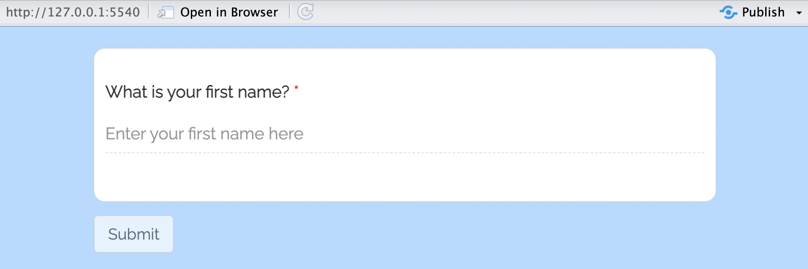
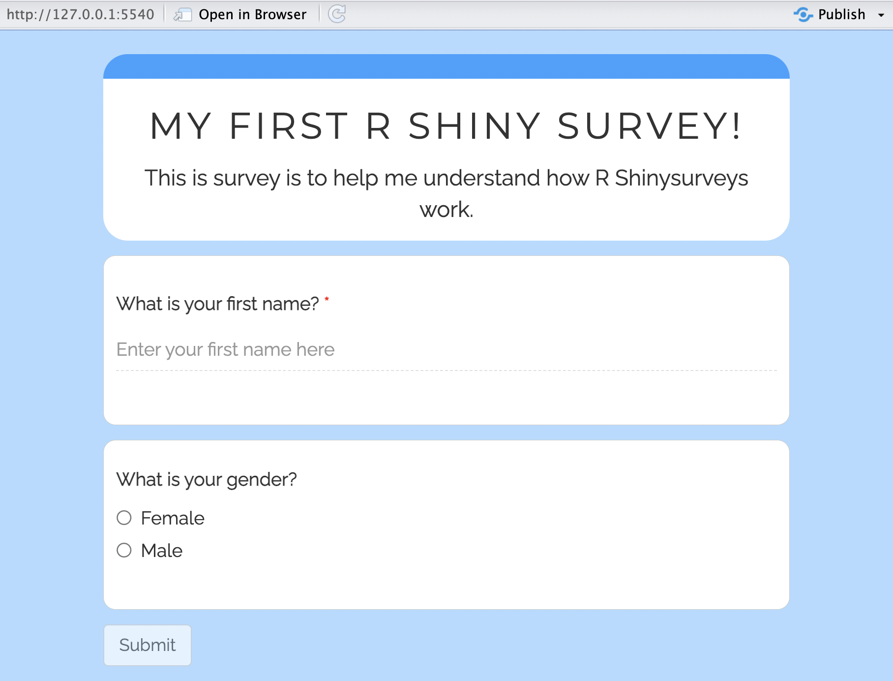
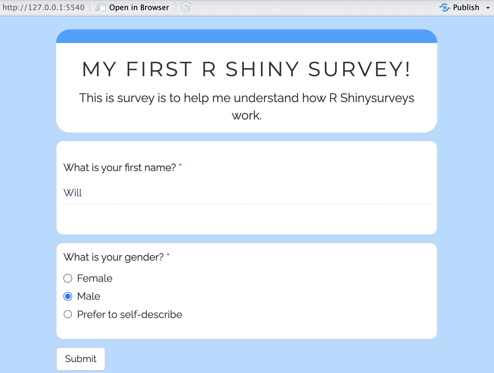
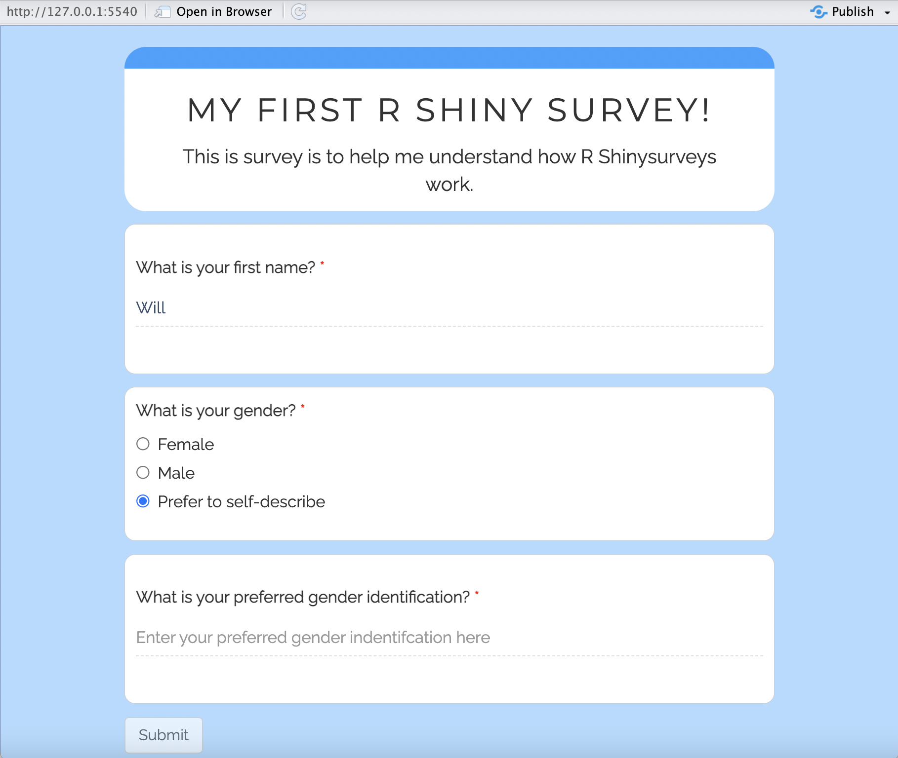
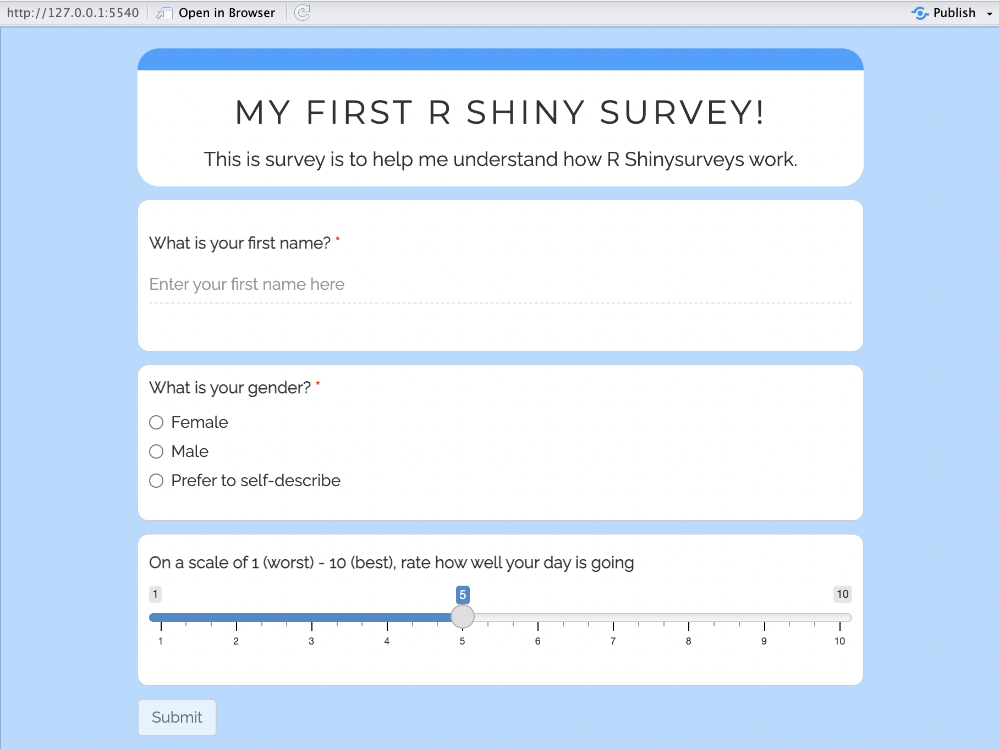

# Implementing Shinysurveys

## Learning Objectives

In this KB entry, you will:
  - Develop surveys using Shinysurveys
  - Create additional input modes
  - Connect your Shiny Survey to Google Sheets via shinyapps.io

## Setting up Shiny Surveys

This KB entry assumes you have gone through the previous KB entry on R Shiny and will build upon some of these concepts. In order to use `Shinysurveys`, you will need to install and load `shinysurveys` as well as loading `shiny`:

```
install.packages("shinysurveys")
library(shinysurveys)
library(shiny)
```

## Developing a survey using Shinysurveys

When using Shinysurveys, the questions are formatted in a structured dataframe. The dataframe has seven slots:
  - `question` - The set of questions you'd like to ask
  - `option` - This can vary with the different input types so we will discuss them as we discuss the various input types
  - `input_type` - This is the type of input (Selection, text response, multiple choice, etc.)
  - `input_id` - A reference ID for this input
  - `dependence` - Which input ID is this question dependent on. If none, then NA
  - `dependence_value` - Which `option` will trigger the dependency
  - `required` - A boolean if this is required to complete the survey

### First example using text responses

Let's go ahead and start with a basic example of text response input:

```
questions_df <- data.frame(
  question = "What is your first name?",
  option = "Enter your first name here",
  input_type = "text",
  input_id = "name",
  dependence = NA,
  dependence_value = NA,
  required = TRUE
)
```

Here we have created the dataframe that `shinysurveys` will employ in order to survey a text response question asking for the respondent's name. Now, we need to set-up the rest of the R Shiny script. The `ui` is pretty simple:

```
ui <- fluidPage(
  surveyOutput(questions_df)
)
```

Lots of the formatting is handled by `shinysurveys`. We just need to specify the dataframe that we want to use within the `surveyOutput()` function. The `server` side is a bit more complicated:

```
server <- function(input, output, session) {
  renderSurvey()
  
  observeEvent(input$submit, {
    response_data <- getSurveyData()
    print(response_data)
  })
}
```

Essentailly, we need to render the survey with `renderSurvey()`, then when we click a "Submit" button on our survey, we would like to print that survey response to our R console. The `getSurveyData()` function grabs the survey data and puts it into a data frame.

Lastly, we need to call our Shiny app:

```
shinyApp(ui, server)
```

The app should look like:

<p align="center">

</p>

Now that you can see the survey it is likely more clear that the `option` argument means for text response. It is the text in the text box when the text is undefined. Also, you can see that because this question has the `required` boolean set to `TRUE`, that the "Submit" button cannot be clicked until there is a text response to the required question.


## Second example with multiple choice

Let's go ahead and add a second question about gender to our survey. To do this we are going to use a different input method, `mc` (for multiple choice). One important distinction once we start working with input methods that have multiple pre-determined answers, we will need to have the data frame entry for each choice. 


```
questions_df_2 <- data.frame(
  question = c("What is your first name?",
               "What is your gender?",
               "What is your gender?"),
  option = c("Enter your first name here",
             "Female",
             "Male"),
  input_type = c("text",
                 "mc",
                 "mc"),
  input_id = c("name",
               "gender",
               "gender"),
  dependence = c(NA,
                 NA,
                 NA),
  dependence_value = c(NA,
                       NA,
                       NA),
  required = c(TRUE,
               FALSE,
               FALSE)
)
```

We can use an almost identical `ui`, `server` and `ShinyApp()` function for this. However, we are going to make a few tweaks:

```
ui <- fluidPage(
  surveyOutput(questions_df_2,
               survey_title = "My first R Shiny Survey!",
               survey_description = "This is survey is to help me understand how R Shinysurveys work.")
)

server <- function(input, output, session) {
  renderSurvey()
  
  observeEvent(input$submit, {
    response_data <- getSurveyData()
    print(response_data)
  })
}

shinyApp(ui, server)
```

Of course we needed to change `questions_df` to `questions_df_2` since we are using a different data frame. Additionally, we added a title and description to our survey with the `survey_title` and `survey_description` arguments. This survey should look like:

<p align="center">

</p>

We can notice that this had added our survey title and description at the top of our survey. Also, as we fill out the survey, we can see that after we type in our name, we are also to click "Submit" without selecting a gender. This is because we set the `required` argument to `FALSE` for our gender entries in "questions_df_2".

## Third Example with dependencies

It could be that you want your survey to have dependencies built into it, where a question is only asked if certain previous responses were answered in a given way. We can do this, by adding in a "Prefer to self-describe" option:

```
questions_df_3 <- data.frame(
  question = c("What is your first name?",
               rep("What is your gender?", 3),
               "What is your preferred gender identification?"),
  option = c("Enter your first name here",
             "Female",
             "Male",
             "Prefer to self-describe",
             "Enter your preferred gender indentifcation here"),
  input_type = c("text",
                 rep("select", 3),
                 "text"),
  input_id = c("name",
               rep("gender", 3),
               "preferred_gender_identification"),
  dependence = c(rep(NA, 4),
                 "gender"),
  dependence_value = c(rep(NA, 4),
                       "Prefer to self-describe"),
  required = c(rep(TRUE, 5))
)
```

The rest of the `ui`, `server` and `ShinyApp()` is siialr to before:

```
ui <- fluidPage(
  surveyOutput(questions_df_3,
               survey_title = "My first R Shiny Survey!",
               survey_description = "This is survey is to help me understand how R Shinysurveys work.")
)

server <- function(input, output, session) {
  renderSurvey()
  
  observeEvent(input$submit, {
    response_data <- getSurveyData()
    print(response_data)
  })
}

shinyApp(ui, server)
```

We've made some changes here to help create less clutter in the code and also demonstrate a different input mode.

1) We are now using the `rep()` function quite a bit. This is not necessary and you could choose to write out "What is your gender?" three times, but I hope it makes the code a bit more concise.
2) We have changed our `input_type` for the gender question from "mc" to "select". This change was only made to demonstrate a different input type. Both input types are compatiable with dependencies.
3) We now have a dependency. Our fifth entry "What is your preferred gender identification?" is dependent on the `input_id` of "gender" and having the "Prefer to self-describe" selected since "Prefer to self-describe" is defined in the `dependence_value` argument. In this case, this might be how the survey could look for someone who identifes as "Male":

<p align="center">

</p>

While someone who identifes as non-binary would have a survey that looks like:

<p align="center">

</p>

## Creating additional input modes

### Slider

Unfortunately, Shinysurvey does not have th entire range of input options that Shiny has by default. However, there are ways to add them. Below, we will show an example of how to add a slider input. In our script we will need to add:

```
extendInputType(input_type = "slider", {
  shiny::sliderInput(
    inputId = surveyID(),
    label = surveyLabel(),
    min = 1,
    max = 10,
    value = 5
  ) 
})
```

And we can check that this input type was added by querying our extended input types with:

```
shinysurveys::listInputExtensions()
```

Now we can add a question to our survey about how the respondent's day is going using a slider:

```
questions_df_4 <- data.frame(
  question = c("What is your first name?",
               rep("What is your gender?", 3),
               "What is your preferred gender identification?",
               "On a scale of 1 (worst) - 10 (best), rate how well your day is going "),
  option = c("Enter your first name here",
             "Female",
             "Male",
             "Prefer to self-describe",
             "Enter your preferred gender indentifcation here",
             NA),
  input_type = c("text",
                 rep("mc", 3),
                 "text",
                 "slider"),
  input_id = c("name",
               rep("gender", 3),
               "preferred_gender_identification",
               "day_feeling_scale"),
  dependence = c(rep(NA, 4),
                 "gender",
                 NA),
  dependence_value = c(rep(NA, 4),
                       "Prefer to self-describe",
                       NA),
  required = c(rep(TRUE, 5), FALSE)
)

ui <- fluidPage(
  surveyOutput(questions_df_4,
               survey_title = "My first R Shiny Survey!",
               survey_description = "This is survey is to help me understand how R Shinysurveys work.")
)

server <- function(input, output, session) {
  renderSurvey()
  
  observeEvent(input$submit, {
    response_data <- getSurveyData()
    print(response_data)
  })
}

shinyApp(ui, server)
```

This App should render like this:

<p align="center">

</p>

### Date

### Checkbox

## Connect your Shiny Survey to Google Sheets via shinyapps.io

### Connecting Google Sheets to your Shiny Survey

It is nice that this input is printed to the console, but that isn't particularly helpful if we are trying to deploy this survey. We may want the responses hosted somewhere like Google Sheets. This KB entry assumes that you have reviewed the KB entry for Google Sheets. The first thing we are going to do is load out `googlesheets4` package.

```
library(googlesheets4)
```

Now we are going to make make a new spreadsheet called "survey_response_data" either directly in Google Sheets or through R. Note, you would not want to put this creation step in your Shiny survey app as it could re-create the spreadsheet each time the app is run.

```
header <- data.frame(matrix(nrow = 0, ncol = 4))
colnames(header) <- c("names", "gender", "preferred_gender", "day_feeling_scale")
gs4_create("survey_response_data", sheets = header)
```
 
We can now modify the `server` of our previos script to write the output to this Google Sheet:

```
questions_df_4 <- data.frame(
  question = c("What is your first name?",
               rep("What is your gender?", 3),
               "What is your preferred gender identification?",
               "On a scale of 1 (worst) - 10 (best), rate how well your day is going "),
  option = c("Enter your first name here",
             "Female",
             "Male",
             "Prefer to self-describe",
             "Enter your preferred gender indentifcation here",
             NA),
  input_type = c("text",
                 rep("mc", 3),
                 "text",
                 "slider"),
  input_id = c("name",
               rep("gender", 3),
               "preferred_gender_identification",
               "day_feeling_scale"),
  dependence = c(rep(NA, 4),
                 "gender",
                 NA),
  dependence_value = c(rep(NA, 4),
                       "Prefer to self-describe",
                       NA),
  required = c(rep(TRUE, 5), FALSE)
)

ui <- fluidPage(
  surveyOutput(questions_df_4,
               survey_title = "My first R Shiny Survey!",
               survey_description = "This is survey is to help me understand how R Shinysurveys work.")
)

server <- function(input, output, session) {
  renderSurvey()
  
  observeEvent(input$submit, {
    response_data <- getSurveyData()
    sheet_append(gs4_find("survey_response_data"), as.data.frame(t(response_data$response)))
  })
}

shinyApp(ui, server)
```

Now we have written from our Shiny Survey to Google Sheets locally, but now we will look into deploying

### Deployment of Shiny Survey with Google Sheets integration onto shinyapps.io

Now we will likely want to deploy our Shiny Survey onto shinyapps.io with Google integration. The first step in doing this is to create a directory to hold your app. In my case, I am going to call it "Example_survey". Within this directory, I am going to place an Rscript called `app.R` which is going to hold the below script:

```
library(shiny)
library(shinysurveys)
library(googlesheets4)

extendInputType(input_type = "slider", {
  shiny::sliderInput(
    inputId = surveyID(),
    label = surveyLabel(),
    min = 1,
    max = 10,
    value = 5
  ) 
})

questions_df_4 <- data.frame(
  question = c("What is your first name?",
               rep("What is your gender?", 3),
               "What is your preferred gender identification?",
               "On a scale of 1 (worst) - 10 (best), rate how well your day is going "),
  option = c("Enter your first name here",
             "Female",
             "Male",
             "Prefer to self-describe",
             "Enter your preferred gender indentifcation here",
             NA),
  input_type = c("text",
                 rep("mc", 3),
                 "text",
                 "slider"),
  input_id = c("name",
               rep("gender", 3),
               "preferred_gender_identification",
               "day_feeling_scale"),
  dependence = c(rep(NA, 4),
                 "gender",
                 NA),
  dependence_value = c(rep(NA, 4),
                       "Prefer to self-describe",
                       NA),
  required = c(rep(TRUE, 5), FALSE)
)

ui <- fluidPage(
  surveyOutput(questions_df_4,
               survey_title = "My first R Shiny Survey!",
               survey_description = "This is survey is to help me understand how R Shinysurveys work.")
)

server <- function(input, output, session) {
  renderSurvey()
  
  observeEvent(input$submit, {
    response_data <- getSurveyData()
    sheet_append("GOOGLE_DRIVE_ID", as.data.frame(t(response_data$response)))
  })
}

shinyApp(ui, server)
```

> NOTE: You will also need to edit the `sheet_append()` function to have the Google Drive ID for your spreadsheet in there. For some reason, the `gs4_find()` function was timing out and disconnecting me.

Next, we are going to need to create a `.secrets` file to be included in the directory that we upload that has our Google key.

```
setwd("~/Documents/Example_survey/")
gs4_auth(email = "YOUR_GOOGLE_ACCOUNT@gmail.com", cache = ".secrets")
```

This should bring up the authentication page that we have seen before with with authentication and complete it. Now add the following line to the top of our  `app.R` script.

```
gs4_auth(cache = ".secrets", email = "YOUR_GOOGLE_ACCOUNT@gmail.com")
```

Now follow the normal instructions for uploading an R Shiny App to shinyapp.io and you are now hosting an Shiny survey on shinyapps.io that is recording your data in real-time to Google Sheets!

## Additional helpful resources
https://shinysurveys.jdtrat.com/articles/surveying-shinysurveys.html
https://cran.r-project.org/web/packages/shinysurveys/vignettes/custom-input-extensions.html
https://debruine.github.io/shinyintro/data.html
