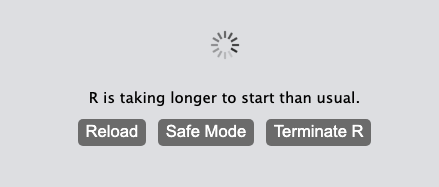
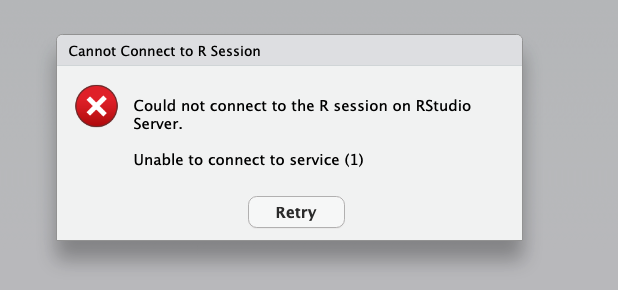

# O2 Portal - R

These are common errors found when running R on the O2 portal and ways to fix them.

## How to launch Rstudio

- Besides your private R library, we have now platform shared R library, add this to *Shared R Personal Library* section
: "/n/data1/cores/bcbio/R/library/4.3.1" (RNAseq and scRNAseq)
- Minimum modules to load for R4.3.*: `cmake/3.22.2 gcc/9.2.0 R/4.3.1 `
- Minimum modules to load for 4.2.1 single cell analyses (some might be specific to trajectory analysis):
`gcc/9.2.0 imageMagick/7.1.0 geos/3.10.2 cmake/3.22.2 R/4.2.1 fftw/3.3.10 gdal/3.1.4 udunits/2.2.28`
- Sometimes specific nodes work better: under "Slurm Custom Arguments":  `-x compute-f-17-[09-25]`

# Issues

## Issue 1 - You can make a session and open Rstudio on O2 but cannot actually type.

Potential solution:  Make a new session and put the following under "Slurm Custom Arguments":  
```
-x compute-f-17-[09-25]
```

## Issue 2 - Everything was fine but then you lost connection.

When you attempt to reload you see:

<p align = "center">

</p>

Potential solutions: Refresh your interactive sessions page first then refresh your R page. 
If that doesn't work close your R session and re-open from the interactive sessions page.
If that doesn't work wait 5-10 min then repeat.

## Issue 3 - You made a session but cannot connect

When you attempt to connect you see:

<p align = "center">

</p>

Potential solutions: This error indicates that either you did not load a gcc module or you loaded the incorrect one for the version of R you are running.
Kill the current session and start a new one with the correct gcc loaded in the modules to be loaded tab.

## Issue 4 - When you finally refresh your environment is gone (THE WORST)

What happened is you ran out of memory and R restarted itself behind the scenes. You will NOT get an error message for this of any kind. The best thing to do is quit your session and restart a new one with more memory.

## Issue 5 - Crashing

Also, previous issues with O2portal RStudio crashing - “the compute-f architecture is not good enough and this part of the process fails because (maybe) it was built/installed on a newer node” .
Solution: add the flag when you start the session to just exclude those nodes -x compute-f-17-[09-25]
