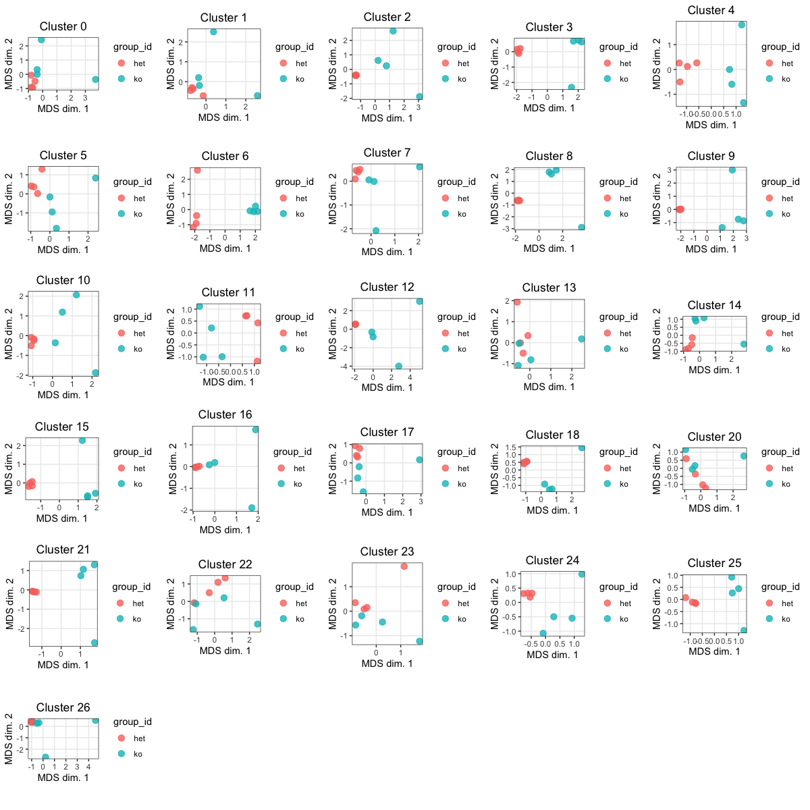

# Pseudobulk DE analysis using edgeR

This markdown takes as input a Seurat object post-clustering. This assumes a pairwise analysis (i.e. comparison between to two groups) and that you have replicates for each group. The clusters in this markdown are simply numbered, but you can use celltype labels if you have just update the appropriate lines of code. 

> **NOTE:** This is adapted frome the [bioC tutorial](http://biocworkshops2019.bioconductor.org.s3-website-us-east-1.amazonaws.com/page/muscWorkshop__vignette/).

## Load libraries

```
library(scater)
library(Seurat)
library(tidyverse)
library(cowplot)
library(Matrix.utils)
library(edgeR)
library(Matrix)
library(reshape2)
library(S4Vectors)
library(SingleCellExperiment)
library(pheatmap)
library(png)
library(RColorBrewer)
library(limma)
library(magrittr)
library(gridExtra)
library(knitr)
library(limma)
```

## Load Integrated Data

```
seurat <- readRDS("data/seurat_integrated_clustered.rds")
seurat
```

## Extract Counts and Metadata

```
# Extract raw counts and metadata to create SingleCellExperiment object
counts <- GetAssayData(object = seurat, slot = "counts", assay="RNA")
metadata <- seurat@meta.data

# Set up metadata as desired for aggregation and DE analysis
Idents(object = seurat) <- "integrated_snn_res.0.6"
metadata$cluster_id <- factor(seurat@active.ident)

# Create single cell experiment object
sce <- SingleCellExperiment(assays = list(counts = counts),
                           colData = metadata)

## Explore the cellular metadata for the dataset
### (number of cells) * (number of meta columns)
dim(colData(sce)) 

```

## Explore the counts data

```{r explore_data,  eval=FALSE, echo=FALSE}
# Explore the raw counts for the dataset

## Check the assays present (only counts)
assays(sce)

## Explore the raw counts for the dataset
### (genes) * (cells)
dim(counts(sce))  

counts(sce)[1:6, 1:6]
```

## Additional QC filtering

We have already filtered cells and so here we remove lowly expressed genes which have less than 10 cells with any counts.

```{r additional_filtering, warning=FALSE,message=FALSE}
# We have already filtered based on the 
# nUMI >= 500
# nGene >= 250
# novelty >= 0.75
# percent mito <=0.25

## Remove lowly expressed genes which have less than 10 cells with any counts
sce <- sce[rowSums(counts(sce) > 1) >= 10, ]

# (genes) x (cells)
dim(sce)
```

## Preparing data for count aggregation
The table below summarizes the total cell count for each individual sample.

```{r data_prep, warning=FALSE, message=FALSE}
# Named vector of cluster names
## 0~25
kids <- purrr::set_names(levels(sce$cluster_id))

# Total number of clusters
## 26
nk <- length(kids)

# Named vector of sample names
sids <- purrr::set_names(levels(as.factor(sce$sampleInfo)))

# Total number of samples 
## 8
ns <- length(sids)

# Generate sample level metadata

## Determine the number of cells per sample
#table(sce$sampleInfo)

## Turn class "table" into a named vector of cells per sample
n_cells <- table(sce$sampleInfo) %>%  as.vector()
names(n_cells) <- names(table(sce$sampleInfo))

## Match the named vector with metadata to combine it
m <- match(names(n_cells), sce$sampleInfo)

## Create the sample level metadata by selecting specific columns
ei <- data.frame(colData(sce)[m, ], 
                  n_cells, row.names = NULL) %>% 
                dplyr::select("sampleInfo", "group", "n_cells")
kable(ei)
```


## Count aggregation
The first few lines of the aggregated count matrix displayed below:

```{r count_aggregation, warning=FALSE,message=FALSE}
# Aggregate the counts per sample_id and cluster_id

# Subset metadata to only include the cluster and sample IDs to aggregate across
groups <- colData(sce)[, c("cluster_id", "sampleInfo")]
groups$sampleInfo <- factor(groups$sampleInfo)

# Aggregate across cluster-sample groups
# Each row corresponds to aggregate counts for a cluster-sample combo
pb <- aggregate.Matrix(t(counts(sce)), 
                       groupings = groups, fun = "sum") 

# class(pb)
# dim(pb)
pb[1:8, 1:8]
```

## Split/subsetting
Here, we split the aggregated matrix into a matrix for each cluster. **In the table below, we report the total number of cells in each sample correposnding to each cluster.**

```{r split_subsetting, warning=FALSE,message=FALSE}
# Not every cluster is present in all samples; create a vector that represents how to split samples
splitf <- sapply(stringr::str_split(rownames(pb), 
                                    pattern = "_",n = 2), `[`, 1)

# Split data and turn into a list
# Each component corresponds to a cluster; storing associated expression matrix (counts)
# Transform data i.e, so rows are genes and columns are samples 
pb <- split.data.frame(pb,factor(splitf)) %>%
        lapply(function(u) 
                set_colnames(t(u), gsub(".*_", "", rownames(u))))

# Explore the different components of list
class(pb)
str(pb)
```

### Print cluster-sample table

**At this point assess the clusters and the number of cells associated in each sample. Decide which clusters to continue with for DE.**

It is generally good to use prominent populations for DE (i.e. high cell counts; > 30 across all samples). However, by that threshold you may exclude too many clusters. For now just removing clusters in which:

* Majority of replicates have few cells (< 10)
* All samples have low numbers of cells

```{r print_cluster-sample_table, warning=FALSE,message=FALSE}
# Print out the table of cells in each cluster-sample group

options(width = 100)
kable(table(sce$cluster_id, sce$sampleInfo))
```

## Starting EdgeR Analysis

### Subset Clusters 

Keep only those clusters that are viable for DE (i.e there are enough cells per sample). 

```{r subset-clusters}
# construct SCE of pseudo-bulk counts for only select clusters
# If you are interested in all clusters AND you have the same samples represented in each cluster you can just use pb

# Create a character vector of the clusters to use for DE
keepClusters <-as.character(c(0:18, 20:26))

# Subset the sce object
(interestingClusters <- SingleCellExperiment(assays = pb[keepClusters]))
```

### MDS plots
Similar to a PCA plot, the MDS allows us to visulize the distances between samples for each cluster. Ideally we'd like "het" samples to segregate together and "ko" together.

```{r mds-plots, warning=FALSE, message=FALSE, fig.width= 14, fig.height=14}
# compute MDS coordinates
mds <-  lapply(as.list(assays(interestingClusters)), function(a){
    DGEList(a, remove.zeros = TRUE) %>% 
    calcNormFactors %>% 
    plotMDS.DGEList(plot = FALSE)
  })  

# Add cluster names
cnames <- paste("Cluster", keepClusters) 
for (m in 1:length(mds)){
  mds[[m]]$cluster <- cnames[m]
}


# prep. data.frame for plotting
plots <- lapply(mds, function(m){
  gg_df <- data.frame(m[c("x", "y")],
                    sample_id = sids,
                    group_id = ei$group,
                    cluster_id = rep(m$cluster, length(m$x)))})

# Create a plotting function
plotFunc <- function(x) {
  ggplot(x, aes(x, y, col = group_id)) + 
    geom_point(size = 3, alpha = 0.8) +
    labs(x = "MDS dim. 1", y = "MDS dim. 2") + 
    ggtitle(unique(x$cluster_id)) + 
    theme_bw() +
    theme(panel.grid.minor = element_blank(),
          plot.title = element_text(hjust = 0.5)) +
    coord_fixed() 
}

# Plot all MDS plots
do.call(grid.arrange,c(lapply(plots, plotFunc)))

```

<p align="center">

</p>

### Run differential expression analysis
First set up the experiment design and a constrast matrix.

```{r run-edgeR, warning=FALSE, message=FALSE}
# construct design & contrast matrix

(design <- model.matrix(~ 0 + ei$group) %>% 
    set_rownames(ei$sampleInfo) %>% 
    set_colnames(levels(factor(ei$group))))

# A positive FC is increased expression in the ko compared to het
(contrast <- makeContrasts("ko-het", levels = design))


# for ea. cluster, run edgeR w/ default parameters
res <- lapply(keepClusters, function(k) {
  y <- assays(interestingClusters)[[k]]
  y <- DGEList(y, remove.zeros = TRUE)
  y <- calcNormFactors(y)
  y <- estimateDisp(y, design)
  fit <- glmQLFit(y, design)
  fit <- glmQLFTest(fit, contrast = contrast)
  topTags(fit, n = Inf, sort.by = "none")$table %>% 
    dplyr::mutate(gene = rownames(.), cluster_id = k) %>% 
    dplyr::rename(p_val = PValue, p_adj = FDR)
})

# Results filtering & overview

# filter FDR < 0.05, |logFC| > 1 & sort by FDR
res_fil <- lapply(res, 
                  function(u)  u %>% 
                    dplyr::filter(p_adj < 0.05, abs(logFC) > 1) %>% 
                    dplyr::arrange(p_adj))
```

### Significant genes
We filter the results with the criteria FDR < 0.05, and |logFC| > 1. For each cluster we report the number of differentially expressed genes and what percentage that represents (of total genes).

```{r sig-genes}
## Count the number of differential findings by cluster.
# nb. & % of DE genes per cluster
n_de <- vapply(res_fil, nrow, numeric(1))
cbind(cluster=keepClusters, numDE_genes=n_de, 
      percentage = round(n_de / nrow(interestingClusters) * 100, digits =2)) %>%  kable()

```

## Write results to file

```{r write-files, echo=FALSE, eval=FALSE}

for(cluster in 1:length(keepClusters)){
  # Full results
  filePath <- paste0("~/Desktop/pseudobulk_edgeR/full_results/Cluster", keepClusters[cluster])
  out <- res[[cluster]][,c("gene", "logFC", "logCPM", "F", "p_val", "p_adj")]
  write.csv(out, file = paste0(filePath, "_het_vs_ko_results.csv"), quote=F, row.names = F)
  
  # Sig genes
  filePath <- paste0("~/Desktop/pseudobulk_edgeR/sig_genes/Cluster", keepClusters[cluster])
  out <- res_fil[[cluster]][,c("gene", "logFC", "logCPM", "F", "p_val", "p_adj")]
  write.csv(out, file = paste0(filePath, "_", "het_vs_ko_sigGenes.csv"), quote=F, row.names = F)
  
}

```


