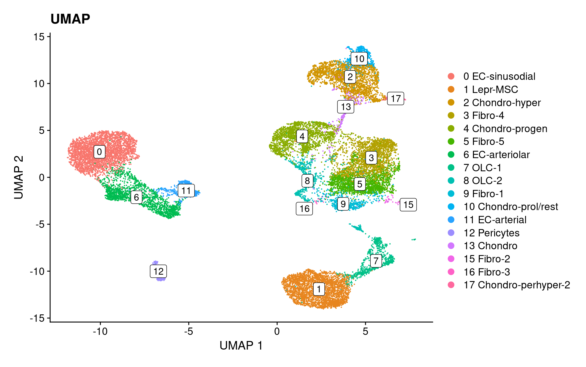

# Here is a collaction of code for nice looking umaps from people in the core. Please add!


## Zhu's pretty white boxes



### Code

**Note: Zhu says "The gist is to add cluster numbers to the ggplot data, then using LableClusters to plot."**

```R
Idents(seurat_stroma_SCT) <- "celltype"

p1 <- DimPlot(object = seurat_stroma_SCT,
             reduction = "umap", 
             label = FALSE,
             label.size = 4,
             repel = TRUE) + xlab("UMAP 1") + ylab("UMAP 2") + labs(title="UMAP")

# add a new column of clusterNo to ggplot data
p1$data$clusterNo <- as.factor(sapply(strsplit(as.character(p1$data$ident), " "), "[", 1))

LabelClusters(plot = p1, id = "clusterNo", box = T, repel = F, fill = "white")
```

## Noor's embedded labels


### Code


```R
LabelClusters(p, id = "ident",  fontface = "bold", size = 3, bg.colour = "white", bg.r = .2, force = 0)
```


